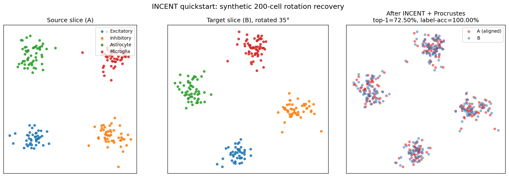

# INCENT

**Integrating Cell type and Neighborhood information for Enhanced alignmeNT of single-cell spatial Transcriptomics data**

[](https://github.com/AfzalHossan-2005021/INCENT/actions/workflows/ci.yml)
[](https://www.python.org/)
[](LICENSE)

INCENT aligns two single-cell spatial transcriptomics (SRT) slices by combining
gene expression, cell-type labels, and a multiscale rotation-invariant
neighborhood descriptor in a fused Gromov-Wasserstein optimal-transport
problem. It supports *unbalanced* alignment with cell-type-aware mass budgets
(so cells present on only one slice are not forced onto a partner) and a
hierarchical coarse-to-fine schedule that scales to whole-tissue datasets.



> **Recovery on a synthetic 200-cell pair related by a 35° rotation:** top-1
> cell-correspondence 72.5%, label-transfer accuracy 100%. Reproduce with
> `python scripts/_make_readme_figure.py`.

## Why INCENT

| Capability                                                       | PASTE | PASTE2 | INCENT |
| ---------------------------------------------------------------- | :---: | :----: | :----: |
| Fused GW alignment of two slices                                 |  ✓    |  ✓     |  ✓     |
| Multiscale **rotation-invariant** neighborhood descriptor (M2)   |  —    |  —     |  ✓     |
| **Cell-type-aware** linear cost (label-mismatch penalty)         |  —    |  ✓     |  ✓     |
| **Per-type unbalanced** budgets via dummy birth/death cells      |  —    |  —     |  ✓     |
| Hierarchical coarse → fine alignment with balanced supercells    |  —    |  —     |  ✓     |
| Spatial-compactness regularizer on the transport plan            |  —    |  —     |  ✓     |
| GPU support via the POT TorchBackend                             |  ✓    |  ✓     |  ✓     |

## Install

INCENT is in active development and not yet on PyPI. Install from source:

```bash
git clone https://github.com/AfzalHossan-2005021/INCENT.git
cd INCENT
pip install -e .
```

Optional extras:

```bash
pip install -e ".[dev]"    # pytest + ruff
pip install -e ".[docs]"   # sphinx + furo
```

For GPU acceleration, install a CUDA-enabled PyTorch wheel matching your
driver before installing INCENT:

```bash
pip install --index-url https://download.pytorch.org/whl/cu121 torch
pip install -e .
```

Tested on Python 3.10 / 3.11 / 3.12 (Linux, macOS).

## Quickstart

```python
import anndata as ad
import incent

# Each slice must carry .obsm["spatial"] (n × 2 coordinates)
# and .obs["cell_type_annot"] (categorical labels).
sliceA: ad.AnnData = ...
sliceB: ad.AnnData = ...

pi = incent.pairwise_align(
    sliceA, sliceB,
    alpha=0.5,        # GW (spatial-structure) weight
    beta=0.3,         # cell-type-mismatch weight (inside the linear cost M1)
    gamma=0.5,        # weight on the multiscale neighborhood cost M2
    unbalanced=True,  # allow cells without a partner via per-type dummy cells
    use_gpu=True,
)
# pi : (n_A, n_B) soft transport plan from cells of A to cells of B.

# Diagnostic metrics (initial vs. final neighborhood / gene-expression /
# cell-type-correspondence):
metrics = incent.calculate_performance_metrics(pi, sliceA=sliceA, sliceB=sliceB)
```

For datasets larger than ~10k cells per slice, prefer the hierarchical
solver:

```python
pi = incent.hierarchical_pairwise_align(
    sliceA, sliceB,
    alpha=0.5, beta=0.3, gamma=0.5,
    target_cluster_size=200,
    label_key="cell_type_annot",
    use_gpu=True,
)
```

A fully reproducible end-to-end walkthrough on synthetic data lives in
[`notebooks/01_quickstart_synthetic.ipynb`](notebooks/01_quickstart_synthetic.ipynb).
A real-data tutorial on the Visium DLPFC samples (Maynard et al. 2021) lives
in [`notebooks/02_dlpfc.ipynb`](notebooks/02_dlpfc.ipynb).

## Hyperparameter cheat-sheet

| Parameter             | Typical range  | Effect                                                                                         |
| --------------------- | -------------- | ---------------------------------------------------------------------------------------------- |
| `alpha`               | 0.1 – 0.7      | Mixing of GW (spatial structure) vs. linear feature cost. Higher → trust spatial geometry more.|
| `beta`                | 0.1 – 0.5      | Strength of cell-type mismatch penalty inside the linear cost.                                 |
| `gamma`               | 0.0 – 1.0      | Weight on the multiscale rotation-invariant neighborhood cost `M2`.                            |
| `reg_compact`         | 0.0 – 5.0      | Spatial-compactness regularizer (Form A) on conditional barycenters of `pi`.                   |
| `radius`              | `None` / float | Neighborhood radius; `None` triggers multiscale radii estimated from local spacing.            |
| `unbalanced`          | `True`/`False` | Enable per-cell-type dummy birth/death budgets so unmatched cells don't force a bad partner.   |
| `target_cluster_size` | 100 – 500      | Coarse supercell size in `hierarchical_pairwise_align`. Smaller → finer coarse step but slower.|

## API

The public surface is:

```python
incent.pairwise_align(sliceA, sliceB, ...)              # full FGW alignment of two slices
incent.hierarchical_pairwise_align(sliceA, sliceB, ...) # coarse → fine schedule for large slices
incent.calculate_performance_metrics(pi, sliceA, sliceB)
incent.calculate_forward_reverse_compactness(pi, sliceA, sliceB)
incent.visualize_alignment(slices, pis, ...)
incent.visualize_cluster_alignment(slices, pis, ...)
```

See `incent.<func>.__doc__` (or the source) for full parameter lists.

## Development

```bash
pip install -e ".[dev]"
pytest -v          # run the test suite (~3 s on CPU)
ruff check .       # lint
```

CI runs both on every push and pull request via GitHub Actions
([workflow](.github/workflows/ci.yml)).

## Citation

```bibtex
@misc{incent2025,
  author = {Hossan, Afzal and contributors},
  title  = {INCENT: Integrating Cell Type and Neighborhood Information for
            Enhanced Alignment of Single-Cell Spatial Transcriptomics Data},
  year   = {2025},
  url    = {https://github.com/AfzalHossan-2005021/INCENT}
}
```

A peer-reviewed publication is in preparation. Until then, please cite the
repository as above.

## Related work

INCENT extends the line of optimal-transport-based SRT alignment methods:

- **PASTE** ([Zeira et al. 2022](https://doi.org/10.1038/s41592-022-01459-6))
- **PASTE2** ([Liu et al. 2023](https://doi.org/10.1101/2023.01.08.523213))
- **moscot** ([Klein et al. 2023](https://doi.org/10.1038/s41587-024-02452-4))
- **GPSA** ([Jones et al. 2023](https://doi.org/10.1038/s41592-023-01972-2))
- **SLAT** ([Xia et al. 2023](https://doi.org/10.1038/s41467-023-43105-5))

INCENT differs from these by jointly using (i) a multiscale rotation-invariant
neighborhood descriptor, (ii) a label-aware unbalanced budget, and (iii) a
hierarchical coarse-to-fine schedule.

## License

MIT — see [`LICENSE`](LICENSE).
