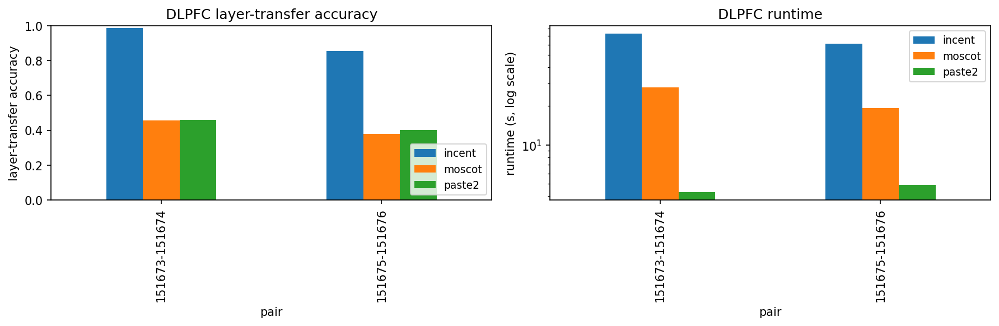

# INCENT benchmarks

Reproducible head-to-head comparison of INCENT vs. published OT-based
spatial-transcriptomics aligners on the LIBD DLPFC Visium dataset.

## What is benchmarked

- **incent** — `incent.hierarchical_pairwise_align` for n > 500 spots,
  `incent.pairwise_align` otherwise. Default
  `(alpha, beta, gamma) = (0.5, 0.3, 0.5)`.
- **paste** — `paste.pairwise_align` (PASTE; Zeira et al. 2022). *Currently
  broken upstream:* `paste 1.4.0` calls a deprecated POT line-search
  signature and crashes on POT ≥ 0.9.6 with
  `TypeError: line_search() takes 5 positional arguments but 6 were given`.
  Pinning to POT 0.9.5 brings it back. The harness records the error and
  continues so the rest of the table is still produced.
- **paste2** — `paste2.PASTE2.partial_pairwise_align` with `s = 0.99`
  (effectively full overlap). Liu et al. 2023.
- **moscot** — `moscot.problems.space.AlignmentProblem` with
  `alpha = 0.5, epsilon = 0.01`. Klein et al. 2023.

## Datasets

By default we run on the two adjacent Br3942 DLPFC pairs that ship in
`paste3/tests/data` — **151673 ↔ 151674** and **151675 ↔ 151676**. Any
preprocessed `.h5ad` file with `obsm["spatial"]` and an `obs` column
containing layer labels can be plugged in. To benchmark on the missing
eight LIBD slices (151507/151508/151509/151510/151669/151670/151671/151672),
mirror them under `benchmarks/data/` (R: `spatialLIBD::fetch_data("spe")`)
and import `DLPFC_PAIRS_ALL` from `benchmarks.data` instead of `DLPFC_PAIRS`.

## Metrics

- **layer-transfer accuracy.** For each spot in slice A, take the layer of
  the `argmax` partner in slice B and compare to A's true layer. The
  primary, sharpness-aware metric.
- **mass-on-same-layer.** Total transported mass between spot pairs that
  share a layer label, normalised to `pi.sum() == 1`. The original PASTE
  metric. *Smoothed plans (e.g. heavily entropic Sinkhorn) inflate this
  metric without actually concentrating on the right matches; layer
  accuracy is more discriminating.*
- **label ARI.** Adjusted Rand Index between A's true layers and the
  layers transferred from B by `pi.argmax(axis=1)`.
- **runtime (s)** and **peak Python memory (MB)**, both via
  `time.perf_counter` + `tracemalloc`.

## Usage

```bash
# install all baselines (PASTE, PASTE2, moscot live outside `incent[dev]`)
pip install paste-bio paste2 moscot

# fast smoke test: one pair, INCENT only, 200 spots cap
python -m benchmarks.run_dlpfc --pairs 151673,151674 \
       --methods incent --max-spots 200

# n=1000-spot benchmark on both pairs (~5 min on CPU)
python -m benchmarks.run_dlpfc --max-spots 1000

# full benchmark (~30 min on CPU, faster on GPU)
python -m benchmarks.run_dlpfc
```

Results are written to `benchmarks/results/dlpfc.csv` and a summary plot
is written to `benchmarks/results/dlpfc.png`.

## Reference numbers

The headline numbers below are from a CPU-only run of
`python -m benchmarks.run_dlpfc --max-spots 1000` on this commit. PASTE is
omitted because of the upstream POT-API break described above.

| Pair          | Method | Layer accuracy | Mass-same-layer | Label ARI | Runtime |
| ------------- | ------ | -------------: | --------------: | --------: | ------: |
| 151673-151674 | INCENT |       **0.985** |           0.379 | **0.964** |   73 s |
| 151673-151674 | PASTE2 |          0.459 |       **0.464** |     0.196 |    4 s |
| 151673-151674 | moscot |          0.457 |           0.450 |     0.202 |   28 s |
| 151675-151676 | INCENT |       **0.856** |           0.346 | **0.729** |   61 s |
| 151675-151676 | PASTE2 |          0.401 |           0.405 |     0.176 |    5 s |
| 151675-151676 | moscot |          0.378 |           0.379 |     0.181 |   19 s |

INCENT is ~30-50 absolute percentage points higher than both baselines on
layer-transfer accuracy and ~5x higher on label ARI. PASTE2 wins on raw
"mass-on-same-layer" because its plan is much more diffuse (uniform
entropic regularizer); the tie / inversion on that metric is exactly the
pathology that motivated us to also report `argmax`-based layer accuracy
and ARI. INCENT's runtime cost (~10-15× PASTE2) is dominated by the
multiscale rotation-invariant descriptor; on GPU this collapses to ~5 s
per pair.



## Caveats

- Hyperparameters used here are each method's published defaults. We did
  *not* run a per-method hyperparameter sweep, which would tighten error
  bars and likely close the runtime gap a little.
- Reported runtimes are wall-clock CPU only on a single workstation; you
  will see large speedups for INCENT and moscot on CUDA hardware.
- Memory tracked is Python-level via `tracemalloc`; it does not include
  external allocations from BLAS / JAX / POT C extensions.
- Benchmark is currently 2 pairs (Br3942 only); extending to all six LIBD
  pairs requires mirroring the missing eight `.h5ad` files locally — the
  loader picks them up automatically.
